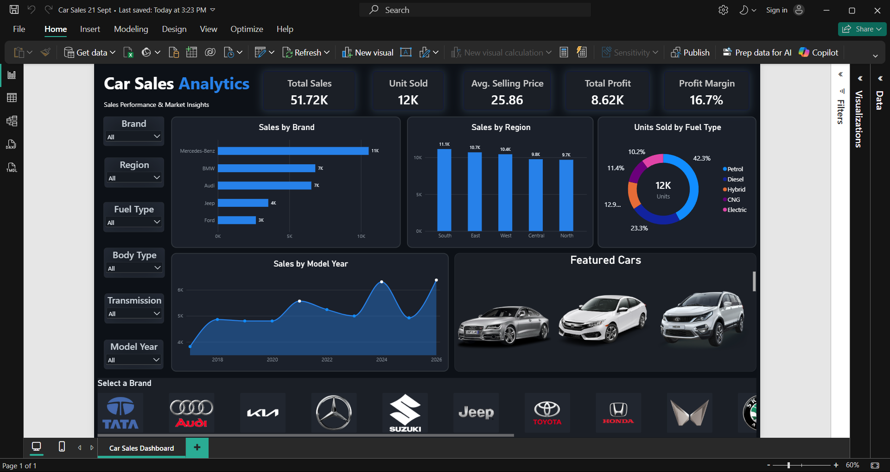

# 🚗 Car Sales Analysis -- Power BI

### Interactive Car Sales Analytics Dashboard \| Power BI Project



------------------------------------------------------------------------

## 📊 Project Overview

This project is an **interactive Car Sales Analytics Dashboard** created
using **Microsoft Power BI** to analyze car sales performance,
profitability, regional trends, fuel-type demand, and brand performance.

Unlike my previous Adidas dashboard, the source dataset for this project
was already structured and clean enough for analysis, so the main focus
of this project was on **data modeling, DAX measures, dashboard design,
interactive filtering, and visual communication**.

The dashboard focuses on:

-   Sales performance
-   Units sold
-   Average selling price
-   Profit performance
-   Profit margin
-   Brand-wise sales
-   Region-wise sales
-   Fuel-type demand
-   Model-year sales trends
-   Interactive brand selection

The main objective was to create a dashboard that provides useful
business insights while maintaining a **simple and readable layout**.

------------------------------------------------------------------------

## 🎯 Business Problem

Car sales datasets can contain multiple brands, regions, fuel types,
model years, and other dimensions. Looking at these records individually
makes it difficult to quickly understand overall sales performance.

This dashboard brings the important metrics and dimensions into a single
interactive report so users can quickly explore:

-   Which brands generate the highest sales?
-   Which regions contribute the most to sales?
-   Which fuel types have the highest unit sales?
-   How do sales change across model years?
-   What is the overall profit and profit margin?
-   How does the analysis change when different filters are applied?

The dashboard was intentionally kept **simple and focused on
readability**, rather than adding a large number of visuals.

------------------------------------------------------------------------

## 🧹 Data Preparation

The source dataset used for this project was already in a suitable
structure for analysis.

Therefore, unlike the Adidas project, this project did not require
extensive data-cleaning work.

The main preparation work focused on:

-   Reviewing the available columns
-   Checking data types
-   Understanding the available dimensions and measures
-   Preparing fields for Power BI visuals
-   Creating calculated measures using DAX
-   Setting up the data for interactive filtering

The project therefore focused more heavily on **dashboard development
and visual storytelling**.

------------------------------------------------------------------------

## 🔄 Data Analysis Workflow

The overall workflow followed in this project was:

``` text
Clean Dataset
     ↓
Data Review
     ↓
Power BI Data Model
     ↓
DAX Measures
     ↓
Visual Selection
     ↓
Dashboard Design
     ↓
Interactive Filtering
     ↓
Final Dashboard
```

This project helped me focus on the next stage of Power BI development:
building a dashboard that is not only functional, but also easy to
understand.

------------------------------------------------------------------------

## 📌 Key Performance Indicators

The dashboard currently provides five high-level KPIs:

  KPI                     Description
  ----------------------- ---------------------------------------
  Total Sales             Total selling price value
  Units Sold              Total number of units sold
  Average Selling Price   Average selling price of cars
  Total Profit            Total profit generated
  Profit Margin           Profit as a percentage of total sales

> KPI values are dynamic and change when filters are applied.

------------------------------------------------------------------------

## 📈 Dashboard Features

The dashboard includes several visualizations designed to provide
different perspectives of the car sales data.

### 1. Sales by Brand

A horizontal bar chart comparing sales generated by different automobile
brands.

This helps identify brands contributing more to overall sales.

### 2. Sales by Region

A column chart comparing sales performance across different regions.

This provides a quick view of regional sales distribution.

### 3. Units Sold by Fuel Type

A donut chart showing unit sales across different fuel types.

This helps understand the distribution of demand across:

-   Petrol
-   Diesel
-   Hybrid
-   CNG
-   Electric

### 4. Sales Trend by Model Year

A line chart showing how sales change across different model years.

This helps identify changes and patterns in sales performance over time.

### 5. Featured Cars

Car images are displayed as a visual section to make the dashboard more
relevant to the automotive theme.

### 6. Interactive Brand Logo Slicer

The dashboard uses **brand logos through a Button Slicer** so users can
interact with brands visually.

Selecting a brand updates the connected dashboard analysis.

------------------------------------------------------------------------

## 🎛️ Interactive Filters

The dashboard includes filters for:

-   Brand
-   Region
-   Fuel Type
-   Body Type
-   Transmission
-   Model Year

These filters allow users to explore different segments without manually
changing the underlying data.

------------------------------------------------------------------------

## 🖼️ Dashboard Design Challenge

One of the main challenges in this project was integrating **car logos
and car images into the dashboard** while keeping them interactive and
visually clean.

The logos were not added only as decorative images. They were
implemented using a **Button Slicer** so that users could select a brand
visually.

Working with:

-   Brand logos
-   Car images
-   Button Slicer
-   Image fields
-   Interactive filtering
-   Dashboard layout

required additional experimentation compared with a standard Power BI
dashboard.

This was one of the more practical UI/UX challenges I faced while
developing the project.

------------------------------------------------------------------------

## 📖 Readability-First Dashboard Design

A major design decision in this project was to **keep the dashboard
simple**.

Instead of adding as many charts and visuals as possible, I focused on
maintaining readability and making the important information easy to
understand.

The dashboard was designed around:

-   Clear KPI cards
-   Limited number of charts
-   Consistent spacing
-   Simple visual hierarchy
-   Dark background with blue accents
-   Interactive filters
-   Visual brand selection
-   Minimal unnecessary elements

The goal was:

> **Every visual should have a purpose.**

This approach helped me understand that a professional dashboard is not
necessarily the one with the most visuals, but the one where users can
understand the information quickly.

------------------------------------------------------------------------

## 🧮 DAX Measure

### Profit Margin

``` dax
Profit Margin =
DIVIDE(
    SUM('Car_Sales_dashboard'[Profit_Lakh]),
    SUM('Car_Sales_dashboard'[Selling_Price_Lakh]),
    0
)
```

This measure calculates profit margin dynamically based on the current
filter context.

------------------------------------------------------------------------

## 🔍 What Can Be Analysed From This Dataset?

### Brand Analysis

The dashboard can be used to compare:

-   Brand-wise sales
-   High-performing brands
-   Brand performance after applying filters

### Regional Analysis

The data can be used to understand:

-   Regional sales distribution
-   High-performing regions
-   Changes in regional performance under different filters

### Fuel Type Analysis

The dashboard provides an overview of unit sales across different fuel
types and allows users to explore demand patterns.

### Model Year Analysis

The sales trend can be used to investigate:

-   Changes in sales across model years
-   Higher and lower performing years
-   Overall sales movement over time

### Profitability Analysis

The dashboard provides:

-   Total profit
-   Profit margin
-   Sales
-   Average selling price

These metrics can be analysed together to understand overall
profitability.

------------------------------------------------------------------------

## 💡 What I Learned From This Project

This project helped me improve my Power BI skills beyond simply creating
charts.

### 1. Dashboard Design Matters

I learned that arranging visuals correctly is important for making a
dashboard easy to read.

### 2. Simplicity Improves Readability

Adding more visuals does not automatically make a dashboard better.

Keeping the dashboard focused helped maintain a clear visual hierarchy.

### 3. Interactive Filtering

I gained more practical experience with slicers and how filters can
connect different dashboard elements.

### 4. Button Slicer & Image Integration

Using logos with a Button Slicer introduced a different type of Power BI
interaction compared with standard dropdown slicers.

### 5. DAX Measures

I practiced creating measures such as Profit Margin and using them
inside KPI cards.

### 6. Visual Storytelling

I learned to think about what each visual is communicating instead of
adding charts simply because the data is available.

------------------------------------------------------------------------

## 📚 Project Focus

The primary focus of this project was:

-   Power BI dashboard development
-   DAX measures
-   Interactive filtering
-   Visual storytelling
-   Dashboard UI/UX
-   Image and logo integration
-   Readability-focused design

The dataset itself did not require extensive cleaning, allowing more
time to focus on the dashboard experience.

------------------------------------------------------------------------

## 🚀 Potential Future Analysis

The dashboard could be extended with additional analysis such as:

-   Year-over-year sales growth
-   Regional profitability
-   Brand profitability
-   Fuel-type profitability
-   Average selling price by brand
-   Units sold by region
-   Body-type analysis
-   Transmission analysis
-   Top and bottom performing models
-   Additional customer or city-level analysis if suitable data is
    available

------------------------------------------------------------------------

## 🛠️ Tools & Technologies

### Tools

-   Microsoft Power BI
-   Power Query
-   DAX
-   Microsoft Excel
-   Git
-   GitHub

### Skills Practiced

-   Data Analysis
-   Data Visualization
-   DAX
-   KPI Design
-   Interactive Filtering
-   Dashboard Design
-   Power BI
-   Business Intelligence
-   Git & GitHub
-   Visual Storytelling

------------------------------------------------------------------------

## 📊 Dashboard Preview

The dashboard provides a single-page overview of car sales performance.

It combines:

-   KPI cards
-   Interactive filters
-   Brand analysis
-   Regional analysis
-   Fuel-type analysis
-   Model-year trend
-   Featured car images
-   Interactive brand logo selection

The overall design intentionally follows a **simple, clean, and
readability-first approach**.

------------------------------------------------------------------------

## 📂 Project Files

  File                         Description
  ---------------------------- ---------------------------------------------
  `Car_Sales_Dashboard.pbix`   Power BI dashboard file
  `Car_Sales_Dataset.xlsx`     Source dataset used for the project
  `Dashboard.png`              Dashboard preview image
  `Car Images/`                Car image assets used in the dashboard
  `Car logos/`                 Brand logo assets used in the Button Slicer

------------------------------------------------------------------------

## 🎓 Project Type

**Data Analytics / Business Intelligence Project**

This project was created to build practical experience with Power BI,
DAX, interactive filtering, dashboard design, and visual storytelling.

------------------------------------------------------------------------

## 👤 Author

**Devansh Gupta**

Data Analytics Project

### Skills

`Power BI` · `DAX` · `Excel` · `Data Analysis` · `Data Visualization` ·
`Business Intelligence`

------------------------------------------------------------------------

⭐ If you find this project useful, feel free to explore the dashboard
and dataset.
